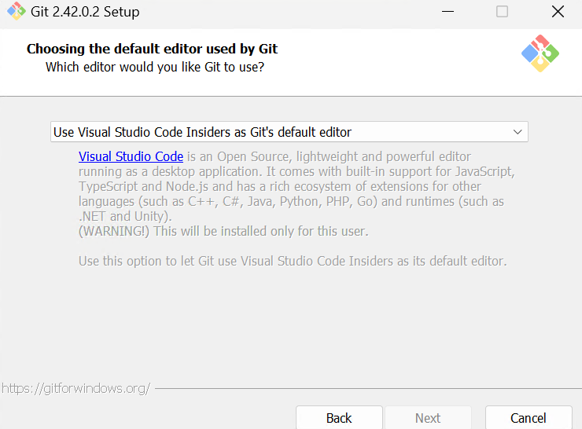
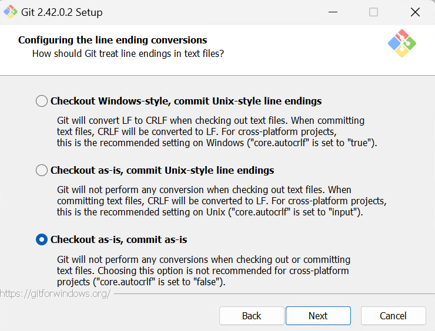
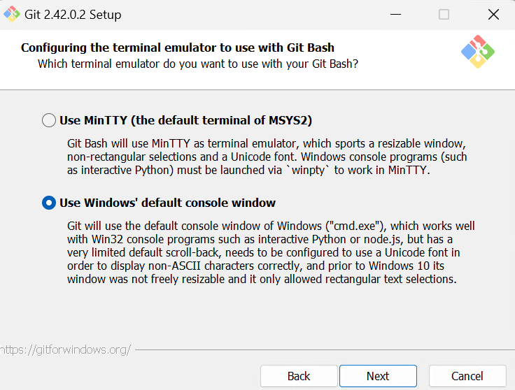

# Introduction
Welcome to the Spike Prime Code Repository Guide! This document is designed to offer a comprehensive overview of the processes and steps to follow when working on Spike Prime projects within our organization, 'MercenaryMadness.' Currently, this document covers the initial steps of software installation and Git setup, with plans to include more detailed information in the future.

# The Process
As of now, this is the process we have decided to follow for coding on Spike Prime:
1. Use the Git repository **FLL2023** (under MecenaryMadness organization on Github) for source control. 
1. Use Python for coding.
2. Use Github for source control.
3. Use Visual Studio Code for:
    - Running git commands (clone, commit, push, pull).
    - Reviewing and comparing code.
    - Practicing Python, etc.

# Software Installation
Please install Python, Visual Studio Code, and Git on your laptops. Here are some instructions if you need help with installation.

## Python
Download and install Python from [here](https://www.python.org/downloads/). If you already have a somewhat recent version installed on your computer, you can skip this step.

## Visual Studio Code (VS Code)
Download and install VS Code from [here](https://code.visualstudio.com/download). In case you have a much older version installed, update it to the latest version.

## Git for Windows
Download and install Git from [here](https://gitforwindows.org/). During the installation, there are several screens where you need to make selections. While going with the default choices is fine, I normally make different choices on few screens, as shown below:

# Setting up Git repository
We already have an organization created on GitHub with the name "MercenaryMadness." This GitHub organization is a type of account that will help us work together as a team on our Spike Prime projects. To join this organization, follow these steps:
1. Create a GitHub account if you do not have one already.
2. Share your GitHub account's email ID (or account name) with one of the admins, so they can send you an invite to join the organization. You can share it in the FLL WhatsApp group.
3. Once the admin sends you the invite, log in to your GitHub account and accept the invitation. You should now be able to see the "FLL2023" repository under the organization's repositories. If you don't see it, follow these steps:
    - Click on the profile picture at the top right corner of the GitHub web page and select "Your Organizations" from the dropdown menu.
    - You should see "MercenaryMadness" listed on the screen. Click on it to go to the organization's home page.
    - Click on the 'Repositories' menu item (top left) and select the "FLL2023" repository.
4. Clone this repository to your laptop, preferably using VS Code.
5. Try out Git commit, push, and pull from VS Code. Make changes only inside the folder with your name.
